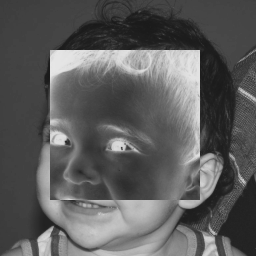

## Pixels

Este exercício tem como objetivo demonstrar a estrutura de cv::Mat(uma matriz) do OpenCV e como podemos manipulá-la. Toda imagem no OpenCV é definida por uma matriz cv::Mat.

O exercício proposto envolve utilizar-se do código denominado pixels.cpp, 

```cpp
#include <iostream>
#include <opencv2/opencv.hpp>
#include <highgui.h>

void negRegion(cv::Rect* rect, cv::Mat* img);
void promptUser(cv::Rect *inputRect,cv::Mat* img); 

int main(int argc, char* argv[])
{
	cv::Mat image;
	cv::Rect rect1;

  image= cv::imread(argv[1],CV_LOAD_IMAGE_GRAYSCALE);
  if(!image.data)
	{
		std::cout << "nao abriu " << argv[1] << std::endl;
	}

	promptUser(&rect1,&image);

  image= cv::imread(argv[1],CV_LOAD_IMAGE_GRAYSCALE);
  if(!image.data)
	{
		std::cout << "[ERROR]: image " << argv[1] << "didn't load." << std::endl;
	}

	negRegion(&rect1,&image);
	cvNamedWindow("Window",CV_WINDOW_AUTOSIZE);
	cv::imshow("Window", image);  
  cvWaitKey();

  return 0;
}

void promptUser(cv::Rect* inputRect,cv::Mat* img)
{
	std::cout << "Define a region.\n" << "X1: ";
	std::cin >> inputRect->x;
	std::cout << "Y1: ";
	std::cin >> inputRect->y;
	std::cout << "X2: ";
	std::cin >> inputRect->width;
	std::cout << "Y2: ";
	std::cin >> inputRect->height;
	if(inputRect->x > img->size().width || inputRect->width > img->size().width)
	{
		std::cout << "Wrong X1 or X2 size, bigger than the image itself, try again, mate." << std::endl;
		promptUser(inputRect,img);
	}
	else if(inputRect->y > img->size().height || inputRect->height > img->size().height)
	{
		std::cout << "Wrong Y1 or Y2 size, bigger than the image itself, try again, mate." << std::endl;
		promptUser(inputRect,img);
	}
	else if(inputRect->y < 0 || inputRect->height < 0 || inputRect->x < 0 || inputRect->width < 0)
	{
		std::cout << "Really?? Negative dimensions?? Try again." << std::endl;
		promptUser(inputRect,img);
	}
}

void negRegion(cv::Rect* rect,cv::Mat *img)
{
  for(int i=rect->y;i<rect->height;i++)
	{
    for(int j=rect->x;j<rect->width;j++)
		{
      img->at<uchar>(i,j)= (-1)* img->at<uchar>(i,j);
    }
  }
}

```
O mesmo tem o objetivo de propor ao usuário definir uma região da imagem que ele queira visualizar como negativo, de forma que, seja a imagem


Utilizando-se do software e tomando uma região retangular delimitada pelos pontos (X1 = 50,Y1 = 50) e (X2 = 200,Y2 = 200), temos a seguinte imagem como resultado:


